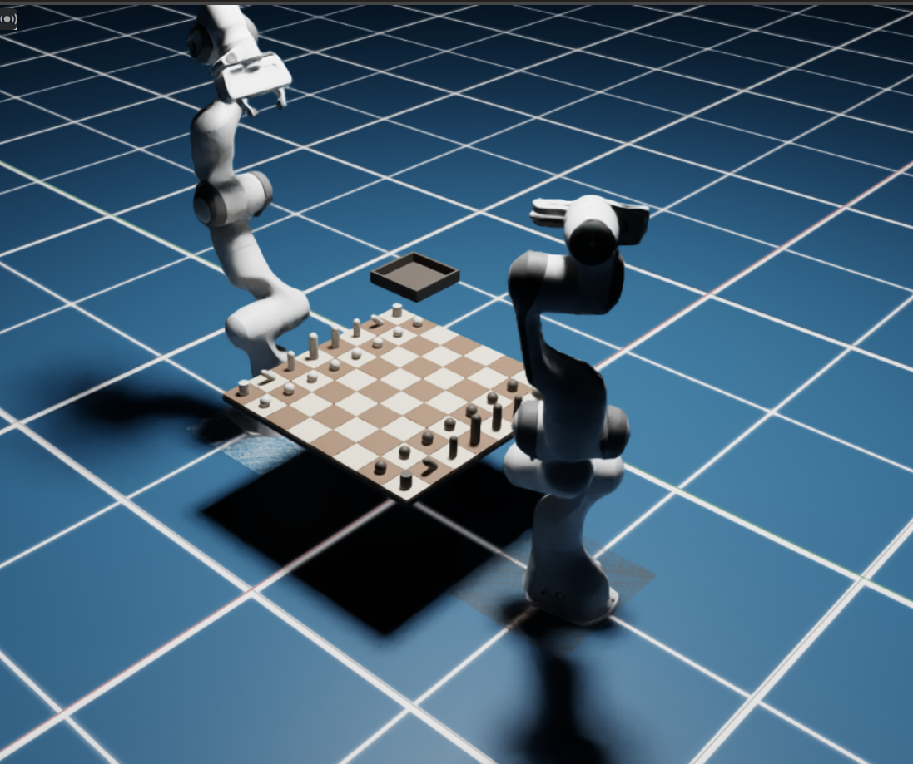

<p align="center">
  
</p>

<h1 align="center">RobotChessPlayer</h1>

<p align="center">
  Dual-Panda robotic chess in ROS 2 Humble, MoveIt 2, and Isaac Sim 4.2
</p>

<p align="center">
  
  
  
  
  
</p>

<p align="center">
  <a href="#what-this-is">What This Is</a> •
  <a href="#implemented-now">Implemented Now</a> •
  <a href="#quickstart">Quickstart</a> •
  <a href="#campaigns-and-learning">Campaigns and Learning</a> •
  <a href="#architecture">Architecture</a>
</p>

## What This Is

RobotChessPlayer is a simulation-first robotics project for autonomous chess manipulation. Two Franka Panda arms sit on opposite sides of a shared board in Isaac Sim, perceive the game state, plan staged motions with MoveIt 2, and execute alternating turns through a ROS 2 coordinator.

The current system is built around three ideas:

- a physical dual-robot chess scene in Isaac Sim 4.2
- a perception pipeline that publishes board pose, confidence, and FEN
- a learned-player workflow where the black side improves offline between batches of matches

White plays with a classical engine. Black plays with a learned checkpoint behind the same FEN-in / UCI-out interface, so the coordinator does not care whether the move source is Stockfish or the RL policy.

## Implemented Now

- Dual Franka Panda scene in Isaac Sim 4.2 with side-specific execution and inactive-arm parking
- ROS 2 Humble + MoveIt 2 motion planning with staged trajectories for chess moves
- Runtime coordinator for white-vs-black matches
- Perception topics for:
  - `/perception/observed_fen`
  - `/perception/fen_confidence`
  - `/perception/board_pose`
- Isaac GUI HUD showing the current board reconstructed from accepted FEN
- Learned-player baseline training, checkpoint promotion, offline retraining, and campaign summaries
- Long-run campaign runner with milestone videos at games `1, 50, 100, ...`

## Quickstart

Build the workspace with system Python:

```bash
source /opt/ros/humble/setup.bash
env PATH=/usr/bin:/bin:$PATH colcon --log-base log_sys build \
  --build-base build_sys \
  --install-base install_sys \
  --cmake-args -DPython3_EXECUTABLE=/usr/bin/python3
source /home/flux/Desktop/chessPlayer/install_sys/setup.bash
```

Run the short learned-player demo:

```bash
cd /home/flux/Desktop/chessPlayer
./repo/scripts/run_engine_vs_learned_demo.sh
```

Run one full game to completion:

```bash
cd /home/flux/Desktop/chessPlayer
MATCH_FORMAT=full ./repo/scripts/run_engine_vs_learned_demo.sh
```

Train and promote a baseline learned checkpoint:

```bash
cd /home/flux/Desktop/chessPlayer
./repo/scripts/train_baseline_learned_player.sh
```

## Campaigns And Learning

Short-format batch run:

```bash
cd /home/flux/Desktop/chessPlayer
MATCH_FORMAT=short TOTAL_GAMES=200 BATCH_SIZE=50 THINK_TIME_SEC=0.1 ./repo/scripts/run_learning_campaign.sh
```

Full-game batch run:

```bash
cd /home/flux/Desktop/chessPlayer
MATCH_FORMAT=full TOTAL_GAMES=50 BATCH_SIZE=10 THINK_TIME_SEC=0.1 ./repo/scripts/run_learning_campaign.sh
```

Full 2000-game learning campaign with milestone videos and offline updates every 50 games:

```bash
cd /home/flux/Desktop/chessPlayer
CAMPAIGN_ID=learned_2000_full \
MATCH_FORMAT=full \
TOTAL_GAMES=2000 \
BATCH_SIZE=50 \
THINK_TIME_SEC=0.1 \
CAPTURE_MILESTONES=1 \
./repo/scripts/run_learning_campaign.sh
```

After each batch, the pipeline can retrain, evaluate, and promote a new learned checkpoint. Campaign summaries are written as JSON and Markdown under `repo/results/campaigns/<campaign_id>/`.

## Architecture

The workspace is intentionally split into two ROS packages:

- `repo/`
  - `chess_manipulator` as the main `ament_python` package
  - motion planning, engine integration, ROS nodes, launch files, campaign tools, and docs
- `chess_manipulator_msgs/`
  - generated ROS 2 interfaces as a sibling `ament_cmake` package

Main subsystems inside `chess_manipulator`:

- `chess_manipulator/chess`
  - board-state management, SAN/UCI helpers, and engine integration
- `chess_manipulator/coordinator`
  - alternating match loop, game logging, checkpoint-driven campaigns
- `chess_manipulator/motion`
  - board calibration, staged planning, MoveIt integration, and trajectory generation
- `chess_manipulator/perception`
  - board anchoring, FEN inference, confidence scoring, and debug overlays
- `chess_manipulator/rl`
  - DQN training, inference, continual-learning utilities, and board encodings
- `chess_manipulator/nodes`
  - runtime executors, bridges, coordinator node, and perception publishers

## Public ROS 2 Interfaces

- Topic: `/joint_states`
- Topic: `/chess/board_state`
- Topic: `/chess/execution_status`
- Topic: `/white/planned_trajectory` carrying `chess_manipulator_msgs/msg/ExecutionCommand`
- Topic: `/white/execution_feedback`
- Topic: `/perception/camera/image_raw`
- Topic: `/perception/debug/annotated_image`
- Service: `/chess/get_best_move`
- Action: `/chess/execute_move`
- Action: `/white/execute_move`

`/chess/execute_move` is now a coordinator-facing action that forwards the move to the white-side robot executor. In `ros_gz`, Gazebo execution completion is driven by the ROS-side joint-position controller shim backing `/panda_arm_controller/follow_joint_trajectory`.

## Clean Build

Use system Python 3.10 for the workspace build:

```bash
source /opt/ros/humble/setup.bash
env PATH=/usr/bin:/bin:$PATH colcon --log-base log_sys build \
  --build-base build_sys \
  --install-base install_sys \
  --cmake-args -DPython3_EXECUTABLE=/usr/bin/python3
source /home/flux/Desktop/chessPlayer/install_sys/setup.bash
```

This avoids Conda Python leaking into ROS interface generation.

## Launch

Isaac-first bringup:

```bash
source /opt/ros/humble/setup.bash
source /home/flux/Desktop/chessPlayer/install_sys/setup.bash
ROS_LOG_DIR=/tmp/ros_logs ros2 launch chess_manipulator bringup.launch.py \
  sim_backend:=isaac \
  launch_native_isaac_app:=true
```

Convenience wrapper:

```bash
/home/flux/Desktop/chessPlayer/repo/scripts/run_ros_demo.sh launch_native_isaac_app:=true isaac_headless:=false
```

Engine-vs-learned-player wrapper:

```bash
/home/flux/Desktop/chessPlayer/repo/scripts/run_engine_vs_learned_demo.sh
```

Current Isaac baseline:
- dual white/black Pandas launch in the same scene
- the overhead camera and synthetic perception path publish into ROS
- separate white and black MoveIt planning stacks are active
- `demo_turn` succeeds end to end for a one-robot engine-driven move
- a short alternating white-vs-black match succeeds through the coordinator
- stage-aware transport metadata now distinguishes capture, primary move, and castling-rook phases

## Demo One Turn

Request a move from the configured engine and execute it through the action server:

```bash
source /opt/ros/humble/setup.bash
source /home/flux/Desktop/chessPlayer/install_sys/setup.bash
ros2 run chess_manipulator demo_turn --think-time 0.25
```

This currently executes a full home -> move -> return-home cycle for the white-side Panda in Isaac Sim.

## Coordinator Demo

Run the shared turn coordinator without the robots to exercise the FEN-in/UCI-out player layer:

```bash
source /opt/ros/humble/setup.bash
source /home/flux/Desktop/chessPlayer/install_sys/setup.bash
ros2 run chess_manipulator game_coordinator --max-plies 4 --white-backend stockfish --black-backend dqn --think-time 0.01
```

For the final operator workflow, use a promoted checkpoint and the learned-player launcher documented below. The generic DQN adapter still supports heuristic fallback for development, but the hardened demo script blocks that by default.

## Operator Workflow

Promote the offline-trained learned-player checkpoint into the stable demo artifact location:

```bash
cd /home/flux/Desktop/chessPlayer
./repo/scripts/promote_learned_checkpoint.sh \
  /home/flux/Desktop/chessPlayer/repo/results/training/black_dqn.pt
```

Or run the bundled offline-learning cycle on saved game logs to train, evaluate, and promote a new candidate automatically:

```bash
cd /home/flux/Desktop/chessPlayer
./repo/scripts/run_offline_learning_cycle.sh
```

Run the short engine-vs-learned-player demo:

```bash
cd /home/flux/Desktop/chessPlayer
./repo/scripts/run_engine_vs_learned_demo.sh
```

Run one full game to completion:

```bash
cd /home/flux/Desktop/chessPlayer
MATCH_FORMAT=full ./repo/scripts/run_engine_vs_learned_demo.sh
```

Train and promote a baseline learned checkpoint:

```bash
cd /home/flux/Desktop/chessPlayer
./repo/scripts/train_baseline_learned_player.sh
```

Run the long learned-player campaign with milestone videos and every-50-game offline updates:

```bash
cd /home/flux/Desktop/chessPlayer
./repo/scripts/run_learning_campaign.sh
```

Short-format batch run:

```bash
cd /home/flux/Desktop/chessPlayer
MATCH_FORMAT=short TOTAL_GAMES=200 BATCH_SIZE=50 THINK_TIME_SEC=0.1 ./repo/scripts/run_learning_campaign.sh
```

Full-game batch run:

```bash
cd /home/flux/Desktop/chessPlayer
MATCH_FORMAT=full TOTAL_GAMES=50 BATCH_SIZE=10 THINK_TIME_SEC=0.1 ./repo/scripts/run_learning_campaign.sh
```

Long-run 2000-game learning campaign with offline updates every 50 games:

```bash
cd /home/flux/Desktop/chessPlayer
CAMPAIGN_ID=learned_2000_full \
MATCH_FORMAT=full \
TOTAL_GAMES=2000 \
BATCH_SIZE=50 \
THINK_TIME_SEC=0.1 \
CAPTURE_MILESTONES=1 \
./repo/scripts/run_learning_campaign.sh
```

This mode plays each game until the coordinator reaches a terminal result from the accepted FEN, logs wins / draws / termination reasons, and retrains/promotes the black-side checkpoint every `BATCH_SIZE` games.

Generate or refresh a metrics summary for a completed campaign:

```bash
/usr/bin/python3 /home/flux/Desktop/chessPlayer/repo/scripts/summarize_campaign.py \
  --campaign-root /home/flux/Desktop/chessPlayer/repo/results/campaigns/<campaign_id> \
  --output-json /home/flux/Desktop/chessPlayer/repo/results/campaigns/<campaign_id>/summary.json \
  --output-markdown /home/flux/Desktop/chessPlayer/repo/results/campaigns/<campaign_id>/summary.md
```

Reset state if the scene drifts or you want a clean relaunch:

```bash
cd /home/flux/Desktop/chessPlayer
./repo/scripts/reset_demo_state.sh
```

Current reset behavior is a full process + scene restart. There is no documented in-place board-reset service in the operator path yet.

## Engine Configuration

Runtime parameters:

- `engine_backend`
- `engine_executable`
- `engine_think_time_sec`
- `sim_backend`
- `square_size_m`
- `board_origin`
- `hover_height_m`
- `pickup_height_m`
- `move_time_sec`
- `execution_timeout_sec`

Default engine path in `config/digital_twin.yaml` is `/usr/games/stockfish`. Override it if your binary lives elsewhere:

```bash
ros2 launch chess_manipulator bringup.launch.py \
  sim_backend:=isaac \
  engine_executable:=/tmp/Stockfish/src/stockfish
```

You can also set engine environment variables such as `CHESS_MANIPULATOR_STOCKFISH`.

## Benchmarks

The benchmark suite covers both engine and system metrics:

- engine legality across a fixed FEN suite
- mean and median move latency
- bestmove reproducibility on repeated fixed-FEN runs
- planner success rate
- invalid IK rejection count
- collision-envelope rejection count
- mean stages per move
- estimated end-to-end latency for a canonical opening sequence

Run the suite:

```bash
/usr/bin/python3 /home/flux/Desktop/chessPlayer/repo/scripts/benchmark_engines.py \
  --suite /home/flux/Desktop/chessPlayer/repo/config/benchmark_suite.yaml \
  --stockfish /tmp/Stockfish/src/stockfish \
  --sunfish /tmp/sunfish/sunfish.py \
  --json-out /home/flux/Desktop/chessPlayer/repo/results/benchmark_results.json \
  --csv-out /home/flux/Desktop/chessPlayer/repo/results/benchmark_results.csv
```

### Current Example Results

| Benchmark | Value |
|---|---:|
| Stockfish legal moves | 4 / 4 |
| Stockfish mean latency | 50 ms |
| Sunfish legal moves | 4 / 4 |
| Sunfish mean latency | 39 ms |

Interpretation:
Sunfish responds slightly faster in the small fixed-time microbenchmark, but Stockfish remains the stronger baseline and default engine for the project.

## RL Scaffold

The repo now includes a bounded DQN scaffold for separate training and runtime inference.

Inference:

```bash
source /opt/ros/humble/setup.bash
source /home/flux/Desktop/chessPlayer/install_sys/setup.bash
ros2 run chess_manipulator rl_infer --fen 'rnbqkbnr/pppppppp/8/8/8/8/PPPPPPPP/RNBQKBNR w KQkq - 0 1'
```

Training:

```bash
source /opt/ros/humble/setup.bash
source /home/flux/Desktop/chessPlayer/install_sys/setup.bash
ros2 run chess_manipulator rl_train --checkpoint /home/flux/Desktop/chessPlayer/repo/results/rl_dqn.pt --episodes 50 --opponent heuristic --device cpu
```

Promotion into the demo artifact location:

```bash
cd /home/flux/Desktop/chessPlayer
./repo/scripts/promote_learned_checkpoint.sh /home/flux/Desktop/chessPlayer/repo/results/rl_dqn.pt
```

The hardened demo path expects the promoted checkpoint at:

```text
/home/flux/Desktop/chessPlayer/repo/results/demo/learned_player/black_dqn.pt
```

PyTorch is required for training and for loading the learned checkpoint at runtime when the black side uses the DQN path.

## Campaign Metrics

Every campaign run can now produce:

- per-game trajectory logs
- milestone videos at games `1, 50, 100, ...`
- offline evaluation/promotions every `50` games
- a campaign summary in JSON and Markdown

The summary generator reports:

- total games completed
- result and termination counts
- mean plies per game
- execution and perception confirmation rates
- mean perception confidence
- milestone game snapshots
- offline update metrics such as legal-rate and agreement-rate

## Simulator Notes

The historical single-robot baseline in this workspace is ROS GZ, documented in [docs/ros_gz_dual_player_demo_plan.md](/home/flux/Desktop/chessPlayer/repo/docs/ros_gz_dual_player_demo_plan.md).

The active branch now targets Isaac Sim 4.2.0 with the Franka Panda preserved as the robot model. The native install and launcher contract are documented in [docs/isaac_setup.md](/home/flux/Desktop/chessPlayer/repo/docs/isaac_setup.md).
The learned-player operator flow is documented in [docs/learned_player_demo.md](/home/flux/Desktop/chessPlayer/repo/docs/learned_player_demo.md).

## Assets

Existing media lives in `media/`. For final portfolio capture, add:

- one short Isaac Sim demo clip
- one Isaac Sim screenshot
- one terminal or RViz screenshot showing ROS execution

## Scope Notes

- Isaac Sim is the primary showcase and development path.
- The current execution confirmation is driven by per-robot Isaac execution feedback, not piece-contact verification.
- Perception is currently a camera + occupancy/debug scaffold, not yet full piece-type recognition.
- Real-robot deployment, advanced grasp physics, and Franka safety certification remain out of scope for this portfolio version.
